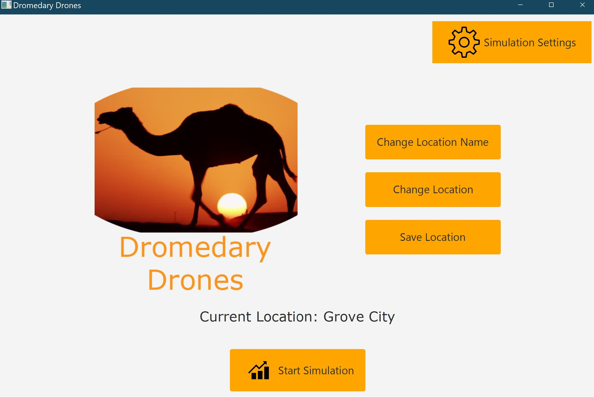

# Dromedary Drones - Blue Team

Dromedary Drones is a java project...

## Getting Started
In order to get your own copy of this project all you need to do is clone the repository. There are no dependencies needed to be downloaded.

## Motivation
This project was created in order to check the legitimacy and possibility of
integrating a drone delivery system on college campuses with the option to
extend to other locations. The initial test is checking Grove City College's
ability to run an effective delivery system.

## Tech/Framework Used
This project uses standard coding practices.

__Built With__
- Java
- JavaFX
- Eclipse IDE

## How to Use
Once you have your copy of the project you can go ahead and run the
Main.java class in the javaFXForms package ([Found here](./src/javaFX_Forms/Main.java)). This will display the main form GUI which will allow you to access several settings forms as well as run a
simulation and view the results of that simulation.

## Credits
This project was written by [David Dray](https://github.com/draydr "David's GitHub account"), [Liz Franz](https://github.com/lizzyfranz "Liz's GitHub account"), [Nate Shaffer](https://github.com/shaffernc17 "Nate's GitHub account"), and [Stephen Stoltzfus](https://github.com/stestoltz "Stephen's GitHub account"). The inspiration for this project came from Dr. Valentine who assigned us the task of building this simulation.
